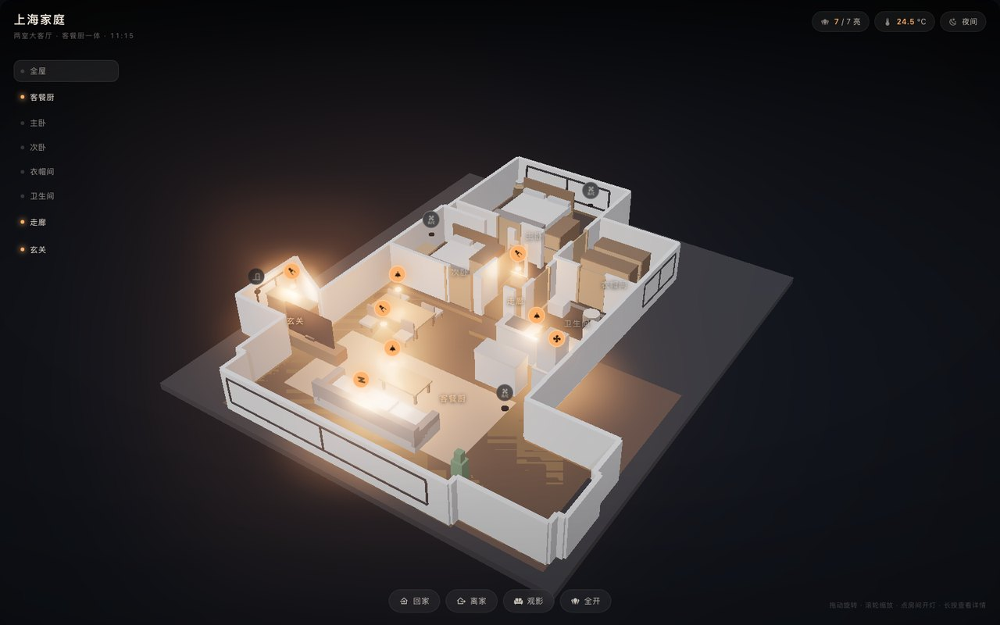
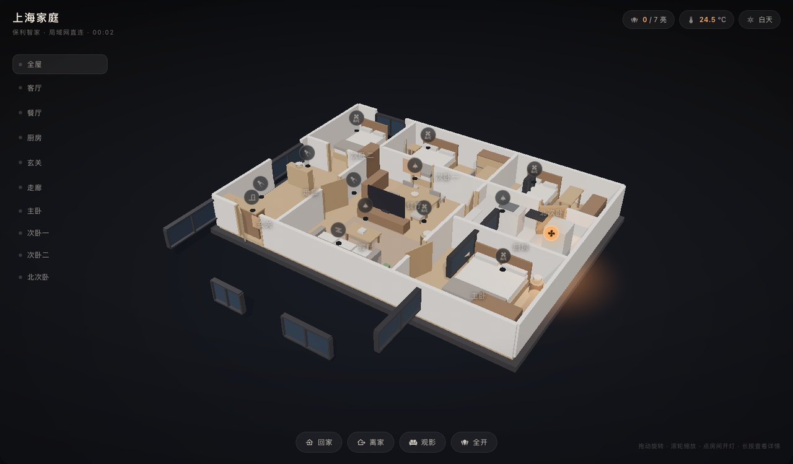

# poly-home-3d

Home Assistant 的 3D 户型中控卡片。用 three.js 实时渲染一栋房子的模型，在模型上点灯、切场景、看温度。




## 特点

- 模型是程序化生成的 glb，不是贴图。墙剖切到 1.2 m，门窗、玻璃、家具、底座都在里面。
- 房间、灯位、场景全部写在外部 JSON 里，改布局不用重新打包。
- 夜里按 `sun.sun` 自动切换：深蓝环境加暖色地面光池，灯位带光晕和光锥。
- 点房间推近镜头，双击回全屋，悬停出描边，点灯位开关灯。
- 自动识别 HA 侧栏布局和全屏布局，按整窗视觉中心取景并避让房间导航。
- 当前示例按飞书户型图的 `12500 × 11200 mm` 主尺寸重建为两室大客餐厨，附带衣帽间、双卫、阳台和开放书房。
- 图标内联在 `src/icons.js`，不依赖 `ha-icon`。
- 示例配置包含 25 个控制入口，含两层卧室窗帘。空调统一采用米家的 5 个实体，避免两套接入重复显示和调用。底部“设备”可查看完整列表；未设置坐标的设备只在列表中显示，离线灯具禁用开关。

## 安装

HACS → 右上角菜单 → 自定义存储库 → 填 `https://github.com/lengjingxu/poly-home-3d`，类型选 **Dashboard** → 安装。

HACS 会自动注册资源 `/hacsfiles/poly-home-3d/poly-home-3d.js`。如果没自动加，在设置 → 仪表盘 → 资源里手动加一条模块类型。

手动安装：把 `dist/` 下的文件放进 `config/www/community/poly-home-3d/`，资源地址填 `/local/community/poly-home-3d/poly-home-3d.js`。

## 用法

```yaml
type: custom:poly-home-3d
config_url: /hacsfiles/poly-home-3d/floorplan.json
```

`config_url` 指向一份 JSON，房间、灯位、场景都写在里面。仓库里那份是示例，把它复制到 `config/www/` 下改，再把 `config_url` 指过去，升级卡片时不会被覆盖。

## 配置字段

| 字段 | 默认值 | 说明 |
| --- | --- | --- |
| `title` / `subtitle` | `上海家庭` / 空 | 左上角品牌区文字 |
| `model` | 空 | glb 路径。写了 `config_url` 时按配置文件的地址解析 |
| `accent` / `background` | `#ffb066` / `#0a0b0e` | 主题色与底色 |
| `bloom` | `0.62` | 辉光强度 |
| `exposure` | `1.02` | 曝光 |
| `light_intensity` | `2.8` | 灯光强度 |
| `light_distance` | `6.0` | 灯位地面光池半径，米 |
| `pool_scale` | `1.0` | 光池整体缩放 |
| `shadows` | `true` | 阴影开关 |
| `show_rail` | `true` | 左栏房间导航开关 |
| `view_height` | `0.35` | 相机注视高度 |
| `ambient_entity` | `sun.sun` | 判昼夜的实体 |
| `camera` | 空 | 固定机位，不写就按包围盒自动取景 |

配置文件内部：

| 字段 | 说明 |
| --- | --- |
| `rooms[].name` | 房间名，用于左栏导航和地面标签 |
| `rooms[].rect` | `[x0, z0, x1, z1]`，单位米，与模型同一坐标系 |
| `rooms[].lights` | 该房间的灯实体，用于亮灯指示和单房间总开关 |
| `markers[]` | `entity` / `name` / `icon`（mdi 名）/ `x` `y` `z`；灯加 `"cone": true` 出光锥 |
| `markers[].source` / `room` | 设备列表显示的来源和房间名称 |
| `markers[].tap_action` | `more-info` 表示点击打开 HA 详情；默认灯、开关和风扇切换开关，其他类型打开详情 |
| `markers[].controls` | 可选的 `[{entity, name}]` 附加控制入口，点击打开对应 HA 实体详情，例如红外空调的模式、温度和开关 |
| `scenes[]` | `name` / `icon` / `service` / `targets[]`，底部按钮 |

## 换模型

`model/build_model.py` 里 `ROOM_POLYGONS` 定义房间轮廓，`OUTER_WALL` 定义外墙，`furniture()` 摆家具，改完跑 `./build.sh` 重新生成。用别的建模软件导出的 glb 也可以，把 `model` 指过去就行，但房间 `rect` 要按新模型的坐标系重写。

## 本地开发

```bash
npm ci
./build.sh
python3 -m http.server 8899
open http://127.0.0.1:8899/preview.html
```

构建时会按 glb 内容生成模型 URL 的版本参数，HA 更新模型后不会继续使用旧浏览器缓存。

`markers` 支持 HA 实体，不限定集成品牌。只有 `light.*` 生成灯光和计入亮灯数量；音箱、摄像头和空调不会生成光池。房间和场景控制会跳过离线、未知或不存在的实体；全部目标不可用时不发送服务调用。设备详情仍可打开查看故障状态。省略全部 `x/y/z` 时，该设备仅显示在列表中。

`preview.html` 用 `config/states.json` 当假状态，查询参数可以换环境：

- `sun=below_horizon|above_horizon` 夜或昼
- `lights=all|off` 全开或全关
- `shadows=0`、`bloom=1.2`、`rail=0` 覆盖配置
- `focus=客厅` 启动后推近某个房间

截图（headless Chrome）：

```bash
W=1240 H=700 node shoot.mjs 'http://127.0.0.1:8899/preview.html?lights=all' /tmp/shot.png 9000
```

高分屏截图可加 `DPR=2`。构建前自动检查地板面朝向和房间地板重叠；`node tests/render.mjs` 会启动临时预览，检查 2 倍像素比、HA 侧栏布局、重复加载、离开/返回页面和缩放时的相机状态。

设备控制测试：`node tests/render.mjs tests/devices-browser.js`。使用本地模拟状态检查主控入口、离线处理和服务目标，不操作真实设备。手机列表检查可加 `W=390 H=844`。

## 许可

MIT

## 组合场景

底部提供回家、离家、观影、就餐、阅读、睡眠和全开，调用 HA 的 `script.poly_home_*`。
`config/scenes.json` 保存这 7 个 HA 脚本配置，可按键名通过 HA 的
`POST /api/config/script/config/{key}` 保存；接口校验并重载脚本。HACS 仅安装卡片，其他家庭需要先按实际实体修改并安装脚本。

| 场景 | 动作 |
| --- | --- |
| 回家 | 玄关、客厅、餐厅开灯；智能主灯 3000 K、70% |
| 离家 | 全屋关灯，关闭 5 台空调 |
| 观影 | 关闭客餐厨主照明，开灯带；智能主灯 2700 K、8% |
| 就餐 | 餐厅灯、灯带开启；智能主灯 3000 K、35% |
| 阅读 | 客厅主灯开启；智能主灯 4000 K、90% |
| 睡眠 | 关闭客餐厨和走廊灯；卧室智能灯 2700 K、8%，关闭布帘和纱帘 |
| 全开 | 全屋开灯；智能灯 4000 K、100% |

这些是一键场景，没有绑定定时、门磁或定位触发。脚本逐步执行，跳过离线、未知和不存在的设备；全部目标不可用时不调用服务。实际服务报错时脚本停止，错误与执行记录在 HA 脚本追踪中查看；卡片“已发送”仅表示 HA 接收启动请求。

场景不会切换另一套空调接入。保利空调实体仍保留在 HA 中。灯组不重复加入全屋灯光目标，电源继电器和智能灯的色温/亮度控制按各自能力配置。

验证：`python3 -m unittest discover -s tests -v`，`node tests/render.mjs tests/scenes-browser.js`，手机端加 `W=390 H=844`。
